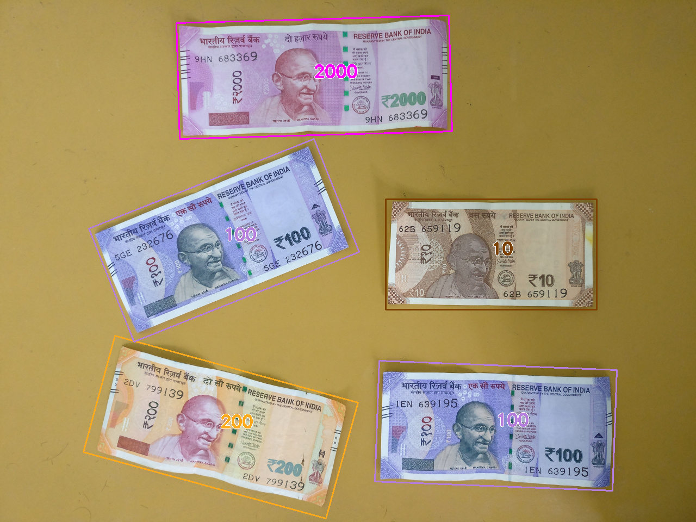

# Indian-Currency-Classification

An application for classifying new indian currency notes using **random forest** classifier. It is implemented with the help of **opencv** and **scikit-learn** library. The dataset used for training consists of **1050** images of new currency notes(INR). It includes denomination of **10, 20, 50, 100, 200, 500 and 2000** rupees notes(i.e. 150 each).

Here we use **hu moments**(shape), **haralick**(texture) and **colour histogram**(colour) as global features and **bag of visual words**(BOVW) with **SIFT** as a local feature descriptor. It is then trained using a random forest classifier, using scikit learn library.

Finally during **inference**, we extract the **rectangular ROI's** from the preprocessed input image using opencv(cropped rotated contour) and then use the trained model to **predict** the class labels.


## Dependencies

* python3, scikit-learn
* opencv+contrib, mahotas
* pickle, joblib

## Demo

### How to run

```python
python bovw.py # Feature extraction
python hyper_train.py # Hyperparameter tuning
python train.py # Model training
python predict.py # Model inference
python currency.py # Currency classification
```

### Training Results

**Best Parameters:-**

```
bootstrap=True, criterion='gini',
min_samples_leaf=1, min_samples_split=2,
min_weight_fraction_leaf=0.0, n_estimators=200,
n_jobs=-1,verbose=1
```

**Accuracy**: 0.98 (+/- 0.01)

**Confusion Matrix:-**

|    | 10 | 20 | 50 | 100 | 200 | 500 | 2000|
|----|----|----|----|-----|-----|-----|-----|
| **10** | 28 | 0  |  1 |   0 |   2 |   0 |   0 |
| **20**  | 0  | 24 |  0 |   0 |   0 |   1 |   0 |
| **50**  | 0  | 0  | 27 |   0 |   0 |   0 |   0 |
| **100** | 0  | 0  |  0 |  32 |   0 |   0 |   0 |
| **200** | 2  | 0  |  0 |   0 |  31 |   0 |   0 |
| **500** | 0  | 1  |  0 |   0 |   0 |  26 |   0 |
| **2000**| 0  | 0  |  0 |   0 |   0 |   0 |  35 |


### Sample Output



## Versioning

Version 1.0

## Authors

Anil Sathyan

## Acknowledgments
* "https://kushalvyas.github.io/BOV.html"
* "https://gogul.dev/software/image-classification-python"
* "https://github.com/briansrls/SIFTBOW"
* "https://www.pyimagesearch.com/2017/01/02/rotate-images-correctly-with-opencv-and-python/"
* "https://towardsdatascience.com/optimizing-hyperparameters-in-random-forest-classification-ec7741f9d3f6"
* "https://stackoverflow.com/questions/11627362/how-to-straighten-a-rotated-rectangle-area-of-an-image-using-opencv-in-python/48553593#48553593"
* "https://opencv-python-tutroals.readthedocs.io/en/latest/py_tutorials/py_imgproc/py_contours/py_contour_features/py_contour_features.html"
